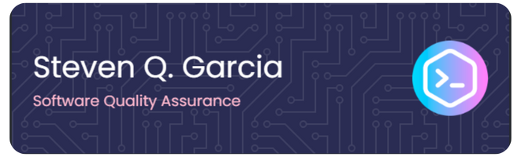

My name is Steven Q. Garcia, and I am a graduating fourth-year student from the Philippines, taking up a Bachelor of Science in Information Technology (BSIT). I aspire to build a career in the Software Quality Assurance (QA) industry. I am eager and passionate about expanding and deepening my knowledge in software testing. I have fundamental experience in manual and functional testing and am familiar with the Software Development Life Cycle (SDLC), particularly the Agile model. I am currently seeking job opportunities or bootcamps to help me take the next step toward my goal of becoming a QA Tester. 

For any inquiries or opportunities, you may contact me at +63 998 254 3997 or via email at sg760621@gmail.com. I would be happy to accommodate and respond to your messages.

Skills:   • Manual Testing   • Functional Testing   • Test Case Creation   • Test Scenario Creation   • Proficient in Documentation   • Microsoft Excel and Word   • With a background in HTML, CSS, C++, Java and Python   

        

